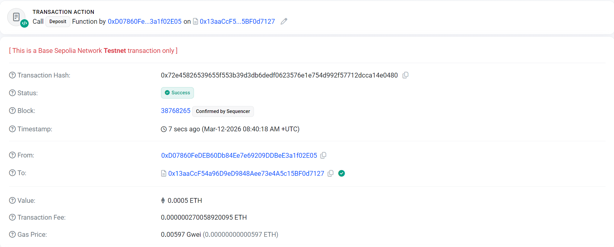
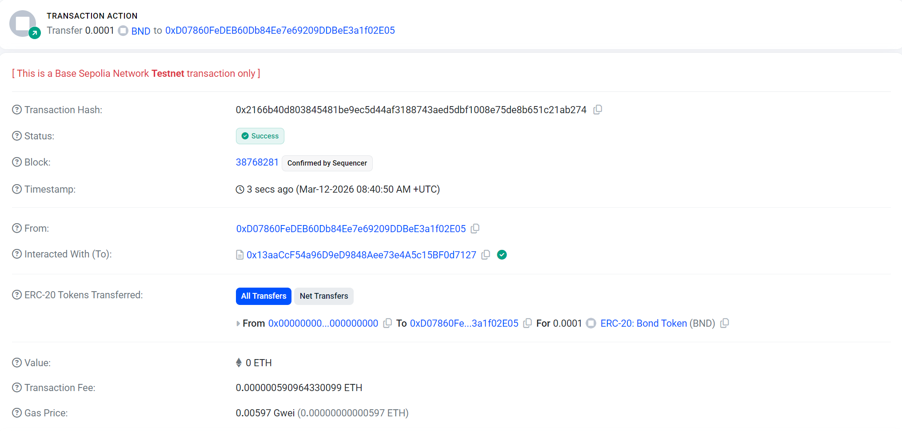
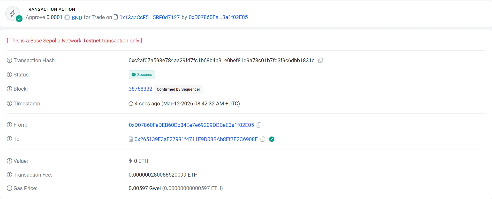
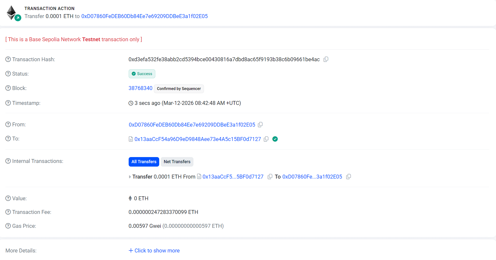
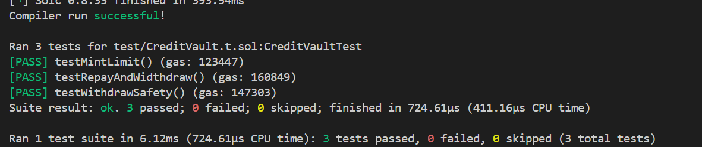

# Credit Vault dApp

A simple **collateralized lending vault** built with Solidity and Foundry.

Users deposit ETH as collateral and can mint a **Bond (BND) ERC20 token** against their collateral based on a fixed **Loan-To-Value (LTV)** ratio.

The project also includes a minimal **Next.js + TypeScript frontend** that allows users to connect their wallet and interact with the vault using MetaMask.

---

# Overview

This project demonstrates:

- Smart contract development using **Solidity**
- Unit testing using **Foundry**
- A simple **decentralized application (dApp)** frontend
- Wallet interaction through **MetaMask**
- Safe contract practices using **OpenZeppelin**

The vault enforces a **50% LTV ratio**, meaning users can only borrow up to half the value of their deposited collateral.

Example:

- Deposit: `100 ETH`
- Maximum borrow: `50 BND`

---

# Tech Used

### Solidity
Used to write the smart contracts.

### Foundry
Used for:

- compiling contracts  
- running tests  
- deploying to testnets  

Chosen because it was recommanded by **Subvisual** and it provides a **fast and modern development workflow** .

### OpenZeppelin
Provides audited implementations of common contracts such as:

- ERC20 token
- ReentrancyGuard

Used to reduce security risks.

### Ethers.js
Used in the frontend to interact with the deployed smart contract.

### Next.js + TypeScript
Used to build a minimal frontend interface for interacting with the vault.

---

# Smart Contract Architecture

## CreditVault.sol

Main contract responsible for:

- accepting ETH collateral
- minting Bond tokens
- enforcing LTV limits
- allowing repayment
- allowing withdrawals

Key functions:

- `deposit()` – deposit ETH collateral
- `mint()` – borrow BND tokens
- `repay()` – repay borrowed tokens
- `withdraw()` – withdraw collateral if LTV is respected

Security features include:

- `ReentrancyGuard`
- custom Solidity errors
- strict LTV checks
- CEI (Checks-Effects-Interactions) pattern

---

## CreditToken.sol

ERC20 token representing the borrowed asset.

Key properties:

- Mintable **only by the vault contract**
- Burned when loans are repaid
- Based on OpenZeppelin's ERC20 implementation

---

## RESULTS

### Deposit



### Mint Bond



### Repay Loan



### Withdraw Collateral



---

# Tests

Tests are written using **Foundry**.

vvv Test result




Run tests with:

```bash

forge test -vvv


forge test --gas-report

Current test cases include:

testMintLimit

Ensures users cannot mint more tokens than allowed by the LTV rule.

testWithdrawSafety

Ensures users cannot withdraw collateral if doing so would break the collateralization ratio.

testRepayAndWithdraw

Verifies that after repaying the full debt, the user can withdraw all their collateral.

Deployment

The contract was deployed to Base Sepolia Testnet.

Vault Contract Address:

0x13aaCcF54a96D9eD9848Aee73e4A5c15BF0d7127

The Bond token is deployed automatically inside the vault constructor.

You can retrieve it by calling:

vault.credit()


Running the Project Locally
Requirements

You will need:

Node.js

Foundry

MetaMask

Install Foundry:

curl -L https://foundry.paradigm.xyz | bash
foundryup
Clone the Repository
git clone <repo-url>
cd <repo>
Run Smart Contract Tests
forge build
forge test
Run the Frontend

Navigate to the frontend folder:

cd frontend

Install dependencies:

npm install

Run the development server:

npm run dev

Open:

http://localhost:3000/vault

Then connect MetaMask and interact with the vault.


Issues Encountered During Development
Token ownership & gas optimization

The CreditToken contract was updated to accept the vault address in its constructor, ensuring that only the vault can mint or burn tokens.
The vault reference was also marked as immutable to reduce gas costs.

Additionally, string-based revert messages were replaced with a custom error:

OnlyVault()

Custom errors reduce deployment and runtime gas usage compared to revert strings.

Missing safety and gas improvements

Several improvements were introduced to improve security and efficiency:

Added ReentrancyGuard

aadded non-zero value checks

Added events for important actions

introduced immutable fields

Added MAX_LTV_PERCENT constant

Implemented a maxMintable() helper function

used call instead of transfer for ETH sends

Replaced revert strings with custom errors

These changes improve both safety and gas efficiency.

Mint / borrow math and CEI ordering

the contract logic was updated to follow the Checks → Effects → Interactions (CEI) pattern.

Specifically:

LTV checks are performed first

Debt state is updated before external interactions

token minting occurs after internal state updates

The mint() function was updated to compute the allowable borrow amount correctly and update user debt before minting tokens.

withdraw rounding and available calculation

there was confusion around the withdrawable collateral calculation due to rounding behavior.

The logic was corrected by:

using consistent rounding 

ensuring maxWithdrawable() always returns an accurate amount

updating the InsufficientCollateral(amount, available) error to return the correct available amount

Foundry tests failing due to exact custom-error bytes

Some tests initially failed because the exact encoded custom error parameters did not match the expected values.

This was fixed by:

computing the exact expected parameters

encoding the error using abi.encodeWithSelector(...)

using vm.expectRevert() where only the revert type mattered

Final test strategy:

strict tests comparing exact encoded custom error values

adjusting withdraw amounts so available > 0 when expected


----------------------------
